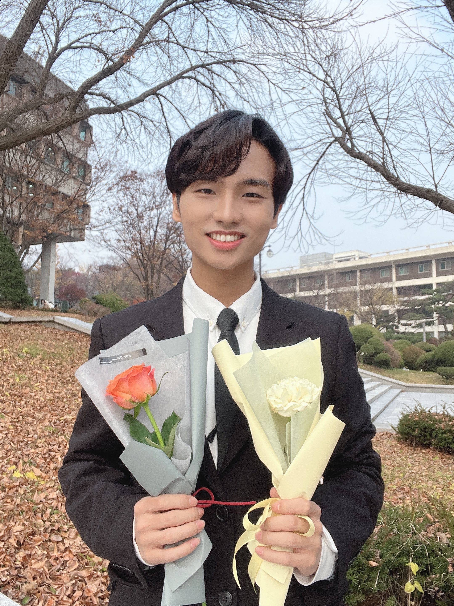

<mark style="all: unset; color: violet">김태형</mark>을 소개합니다
===

<ul style="list-style: none; padding-left: 1em">
    <li>📌 17학번 98년생</li>
    <li>📌 철학과 / 연합전공 정보문화학</li>
    <li>💃 222hz, SAZAHOO, Danbeat Studio</li>
    <li>📌 Instagram: @taehyeungkim98</li>
</ul>

### 나의 취미: 춤💃🕺
>저는 고등학교때부터 취미로 춤을 추기 시작해서, 지금까지 거의 10년간 계속 춤을 추고 있습니다. 춤을 추는 시간만큼은 아무 생각 없이 나 자신을 음악에 맡길 수 있다는 점이 큰 매력인 것 같아요. 또한 춤을 추면서 다양한 사람들을 만날 수 있다는 점도 춤의 큰 매력인 것 같습니다. 때로는 연습 과정이 지치고 힘들 때도 있지만, 성공적으로 공연을 끝마치고 나면 그런 힘든 과정들은 충분히 보상을 받습니다! 앞으로도 몸이 허락하는 한(?) 계속 춤을 출 것 같아요😄
---

### 개발자가 되고 싶은 이유?
> 어렸을 때는 제가 좋아하는 것이 뭔지 잘 모르는 그저 그런 모범생이었어서, 법조인, 의사 등등 그냥 다른 사람 말 따라 진로 희망란을 작성했던 것 같아요. 그러던 중 대학에 와서 코딩 수업을 듣게 되었는데, 크고 작은 프로젝트를 진행하면서 재미와 설렘을 느꼈던 것 같습니다. 특히 세상에 없는 새로운 무언가를 직접 만들어낼 수 있다는 점이 제게 큰 매력으로 다가왔던 것 같아요. 이렇게 좋아하는 것을 직업으로 삼을 수 있다면 제 인생이 행복해지지 않을까 해서 개발자를 진로로 설정하게 되었답니다.
---
### 멋사에서의 목표?
>문제를 발견하는 통찰력과 새로이 해결하는 참신함을 갖춘 개발자로의 성장, 더불어 좋은 사람들을 많이 알아가기!